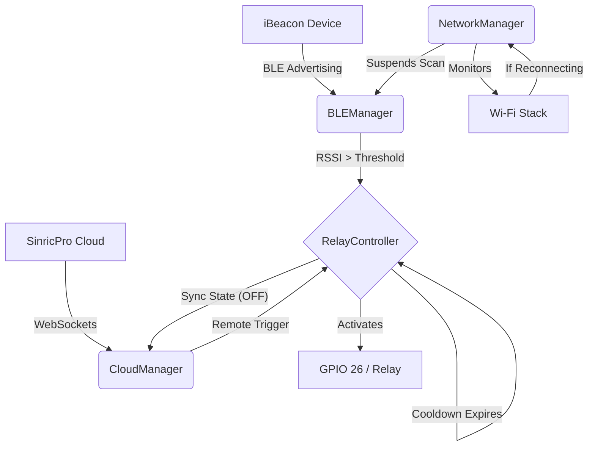

# BeconTrigger (AutoPass System)

An enterprise-grade, ESP32-based access control system utilizing Bluetooth Low Energy (BLE) iBeacons and cloud integration. Designed for resilience, this project features hardware watchdog timers, automated Wi-Fi reconnections, and OTA (Over-The-Air) updates.

## 🚀 Features
* **BLE iBeacon Detection:** Continuously scans for a specific target UUID and evaluates proximity via RSSI thresholds.
* **Modular Architecture:** Clean Separation of Concerns (SoC) using C++ classes (`BLEManager`, `NetworkManager`, `RelayController`, etc.).
* **Cloud Integration (SinricPro):** Dual control via physical proximity or remote cloud dashboard. State is synchronized bi-directionally.
* **Resilience:** Built-in Hardware Watchdog Timer (WDT) and autonomous Wi-Fi reconnect logic.
* **Advanced Logging:** Unified logging interface routing messages to Serial, Telnet, and BLE UART simultaneously.

## 🏗️ Architecture



## 🛠️ Hardware Setup
1. **Microcontroller:** ESP32 (e.g., ESP-WROOM-32).
2. **Relay Module:** Connected to `GPIO 26`.
3. **Power:** Ensure stable 5V power supply to drive the relay coil safely.

## ⚙️ Getting Started

### 1. Configure Secrets
Never commit your passwords! Copy the example configuration file:
```bash
cp include/config.h.example include/config.h
```
Edit `include/config.h` with your specific credentials:
* Wi-Fi SSID and Password
* SinricPro App Key, App Secret, and Device ID
* Target iBeacon UUID

### 2. Build and Upload
This project is built using [PlatformIO](https://platformio.org/).
To build and upload via USB:
```bash
pio run -t upload
```
To monitor the serial output:
```bash
pio device monitor -b 115200
```

### 3. Remote Updates (OTA)
Once initially flashed, subsequent updates can be pushed over Wi-Fi. Modify `platformio.ini` to set the `upload_port` to your ESP32's IP address.

## 📚 Code Documentation
This project uses **Doxygen** for professional, inline code documentation. 
To generate the HTML reference manual locally:
```bash
doxygen Doxyfile
```
Open `html/index.html` in your web browser.
